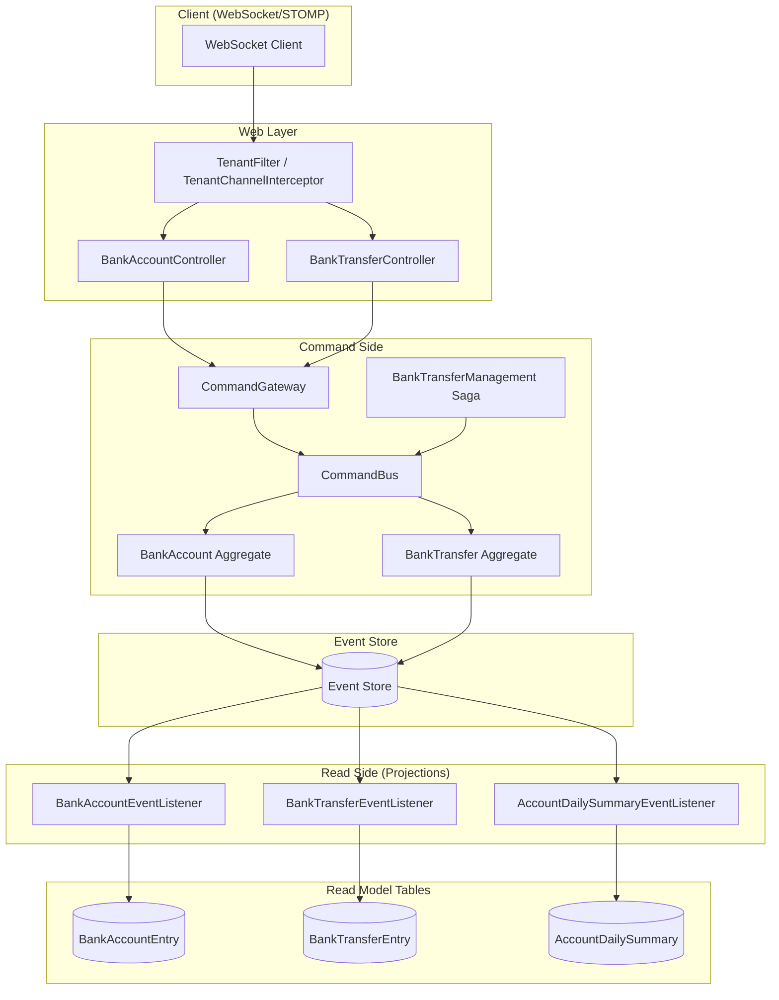

# Bank Multi-Tenant

A sample event-sourced banking application demonstrating Axon Framework capabilities, including multi-tenancy, projections, snapshotting, and replay.

## Domain

The application consists of two aggregates: **Bank Account** and **Bank Transfer**. It balances complexity and simplicity to showcase Axon Framework building blocks without obscuring the core patterns.

## Architecture



## Multi-Tenancy

Commands and events carry `tenant_id` in metadata. Read models are scoped by tenant.

**Setting tenant context:**
- **HTTP**: `X-Tenant-ID` header
- **STOMP**: `tenant-id` header on SEND/SUBSCRIBE frames
- **UI**: Tenant selector in navbar (default, tenant-a, tenant-b); choice persisted in sessionStorage

When not provided, tenant defaults to `"default"`.

**Note:** If you see a startup warning about correlation providers, `tenant_id` may not propagate to events. The app tries to add it at runtime; if that fails, provide a `Configurer` bean that calls `configureCorrelationDataProviders(...)` with `MessageOriginProvider` and `SimpleCorrelationDataProvider("tenant_id")`.

## Projections (Read Models)

| Projection | Table | Processing Group | Purpose |
|------------|-------|------------------|---------|
| BankAccount | BankAccountEntry | default | Account list & balance |
| BankTransfer | BankTransferEntry | default | Transfer status |
| AccountDailySummary | account_daily_summary | account-daily-summary | Daily rollup (deposits, withdrawals, closing balance) |

## Replay / Rebuild

To rebuild the **AccountDailySummary** projection from the event store:

1. Set `axon.admin.rebuild-enabled=true` in `application.properties`.
2. Configure admin credentials: `axon.admin.username` and `axon.admin.password` (default: admin/admin).
3. Call the rebuild endpoint with HTTP Basic auth:

```bash
curl -u admin:admin -X POST http://localhost:8080/admin/projections/account-daily-summary/rebuild
```

3. The processor resets its tracking token and replays all bank account events. Progress is asynchronous.

**Order of operations:**
- Clear `account_daily_summary` table
- Shut down `account-daily-summary` TrackingEventProcessor
- Reset its token to the beginning
- Start the processor → events replay and projection rebuilds

## Snapshotting

Improves aggregate load performance for accounts with many events. See [docs/SNAPSHOTTING.md](docs/SNAPSHOTTING.md).

```properties
axon.snapshotting.enabled=true
axon.snapshotting.bank-account.threshold=50
```

## Technical Details

- **Stack**: Spring Boot 1.5, Axon Framework 3.0.4, JPA/H2 (single-node), MySQL (distributed)
- **Transport**: WebSocket + STOMP
- **Command routing**: Local or DistributedCommandBus (distributed profile)
- **Security**: Spring Security protects `/admin/**` with HTTP Basic when rebuild is enabled

## Usage

### Single node (in-memory)

```bash
mvn clean install
java -jar web/target/bank-multi-tenant-web-0.0.1-SNAPSHOT.jar
```

### Distributed (Docker)

```bash
mvn clean install
mvn -pl web docker:build
docker-compose up db   # Initialize DB, then stop
docker-compose up
```

- Instance 1: [http://localhost:8080/](http://localhost:8080/)
- Instance 2: [http://localhost:8081/](http://localhost:8081/)

## Tests

```bash
mvn test
```

Key tests:
- **TenantIsolationTest**: Ensures tenant A's data does not appear in tenant B's queries
- **AccountDailySummaryReplayDeterminismTest**: Verifies replay produces identical projection state

## Contributors

- **Rifat Alam Pomil**
